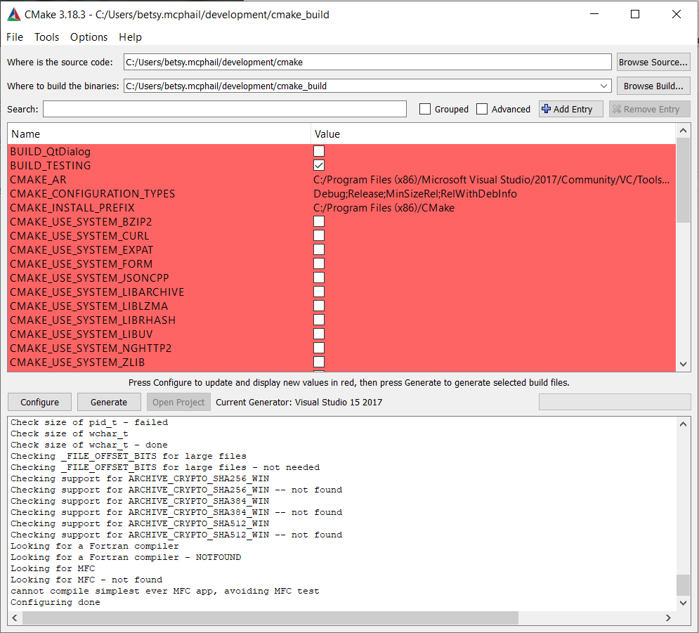

# Running the CMake GUI
CMake includes a Qt-based user interface that can be used on most platforms, including UNIX, Mac OS X, and Windows. The [`cmake-gui`](https://cmake.org/cmake/help/latest/manual/cmake-gui.1.html#manual:cmake-gui(1)) is included in the CMake source code, but you will need an installation of Qt on your system in order to build it.

On Windows, the executable is named `cmake-gui.exe` and it should be in your Start menu under Program Files. There may also be a shortcut on your desktop, or if you built CMake from the source, it will be in the build directory. For UNIX and Mac users, the executable is named `cmake-gui` and it can be found where you installed the CMake executables. A GUI will appear similar to what is shown in Figure 1. The top two fields are the source code and binary directories. They allow you to specify where the source code is located for what you want to compile, and where the resulting binaries should be placed. You should set these two values first. If the binary directory you specify does not exist, it will be created for you. If the binary directory has been configured by CMake before, it will then automatically set the source tree.
