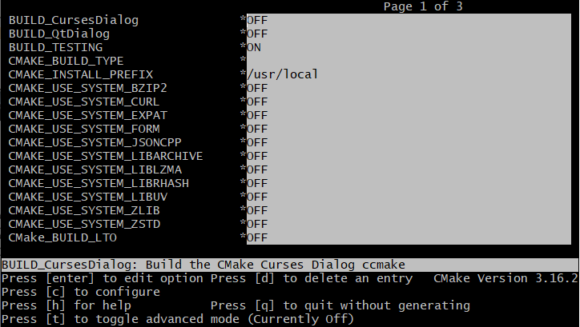

# Running the ccmake Curses Interface
On most UNIX platforms, if the curses library is supported, CMake provides an executable called [`ccmake`](https://cmake.org/cmake/help/latest/manual/ccmake.1.html#manual:ccmake(1)). This interface is a terminal-based text application that is very similar to the [`cmake-gui`](https://cmake.org/cmake/help/latest/manual/cmake-gui.1.html#manual:cmake-gui(1)). To run [`ccmake`](https://cmake.org/cmake/help/latest/manual/ccmake.1.html#manual:ccmake(1)), change directories into the directory where you want the binaries to be placed. Then run [`ccmake`](https://cmake.org/cmake/help/latest/manual/ccmake.1.html#manual:ccmake(1)) with the path to the source directory on the command line. This will start the text interface as shown in Figure 2.

Brief instructions are displayed in the bottom of the window. If you hit the “c” key, it will configure the project. You should always configure after changing values in the cache. To change values, use the arrow keys to select cache entries, and hit the enter key to edit them. Boolean values will toggle with the enter key. Once you have set all the values as you like, you can hit the “g” key to generate the Makefiles and exit. You can also hit “h” for help, “q” to quit, and “t” to toggle the viewing of advanced cache entries.
