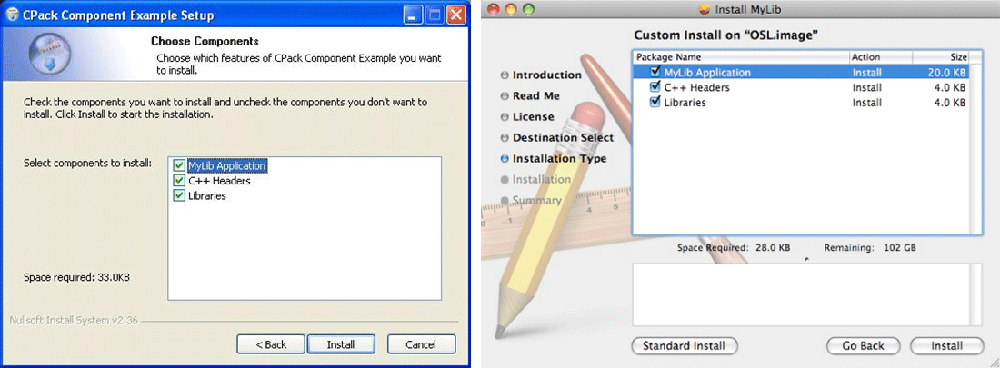
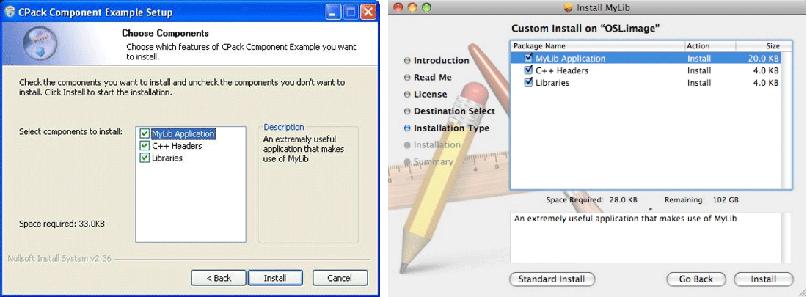
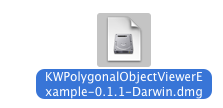
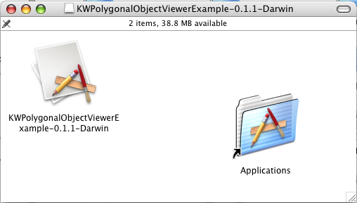

# Packaging With CPack
CPack is a powerful, easy to use, cross-platform software packaging tool distributed with CMake. It uses the generators concept from CMake to abstract package generation on specific platforms. It can be used with or without CMake, but it may depend on some software being installed on the system. Using a simple configuration file, or using a CMake module, the author of a project can package a complex project into a simple installer. This chapter will describe how to apply CPack to a CMake project.

## CPack Basics
Users of your software may not always want to, or be able to, build the software in order to install it. The software may be closed source, or it may take a long time to compile, or in the case of an end user application, the users may not have the skill or the tools to build the application. For these cases, what is needed is a way to build the software on one machine, and then move the install tree to a different machine. The most basic way to do this is to use the DESTDIR environment variable to install the software into a temporary location, then to tar or zip up that directory and move it to another machine. However, the DESTDIR approach falls short on Windows, simply because path names typically start with a drive letter (C:/) and you cannot simply prefix one full path with another and get a valid path name. Another more powerful approach is to use CPack, included in CMake.

CPack is a tool included with CMake, it can be used to create installers and packages for projects. CPack can create two basic types of packages, source and binary. CPack works in much the same way as CMake does for building software. It does not aim to replace native packaging tools, rather it provides a single interface to a variety of tools. Currently CPack supports the creation of Windows installers using NullSoft installer NSIS or WiX, Mac OS X PackageMaker tool, OS X Drag and Drop, OS X X11 Drag and Drop, Cygwin Setup packages, Debian packages, RPMs, .tar.gz, .sh (self extracting .tar.gz files), and .zip compressed files. The implementation of CPack works in a similar way to CMake. For each type of packaging tool supported, there is a CPack generator written in C++ that is used to run the native tool and create the package. For simple tar based packages, CPack includes a library version of tar and does not require tar to be installed on the system. For many of the other installers, native tools must be present for CPack to function.

With source packages, CPack makes a copy of the source tree and creates a zip or tar file. For binary packages, the use of CPack is tied to the install commands working correctly for a project. When setting up install commands, the first step is to make sure the files go into the correct directory structure with the correct permissions. The next step is to make sure the software is relocatable and can run in an installed tree. This may require changing the software itself, and there are many techniques to do that for different environments that go beyond the scope of this book. Basically, executables should be able to find data or other files using relative paths to the location of where it is installed. CPack installs the software into a temporary directory, and copies the install tree into the format of the native packaging tool. Once the install commands have been added to a project, enabling CPack in the simplest case is done by including the CPack.cmake file into the project.

### Simple Example
The most basic CPack project would look like this
```cmake
cmake_minimum_required(VERSION 3.20)
project(CoolStuff)
add_executable(coolstuff coolstuff.cxx)
install(TARGETS coolstuff RUNTIME DESTINATION bin)
include(CPack)
```

In the CoolStuff project, an executable is created and installed into the directory bin. Then the CPack file is included by the project. At this point project CoolStuff will have CPack enabled. To run CPack for a CoolStuff, you would first build the project as you would any other CMake project. CPack adds several targets to the generated project. These targets in Makefiles are package and package_source, and PACKAGE in Visual Studio and Xcode. For example, to build a source and binary package for CoolStuff using a Makefile generator you would run the following commands:
```shell
mkdir build
cd build
cmake ../CoolStuff
make
make package
make package_source
```

This would create a source zip file called `CoolStuff-0.1.1-Source.zip`, a NSIS installer called `CoolStuff-0.1.1-win32.exe`, and a binary zip file `CoolStuff-0.1.1-win32.zip`. The same thing could be done using the CPack command line.
```shell
cd build
cpack --config CPackConfig.cmake
cpack --config CPackSourceConfig.cmake
```

### What Happens When CPack.cmake Is Included?
When the `include(CPack)` command is executed, the `CPack.cmake` file is included into the project. By default this will use the [`configure_file`](https://cmake.org/cmake/help/latest/command/configure_file.html#command:configure_file) command to create `CPackConfig.cmake` and `CPackSourceConfig.cmake` in the binary tree of the project. These files contain a series of set commands that set variables for use when CPack is run during the packaging step. The names of the files that are configured by the `CPack.cmake` file can be customized with these two variables; `CPACK_OUTPUT_CONFIG_FILE` which defaults to `CPackConfig.cmake` and `CPACK_SOURCE_OUTPUT_CONFIG_FILE` which defaults to `CPackSourceConfig.cmake`.

The source for these files can be found in the `Templates/CPackConfig.cmake.in`. This file contains some comments, and a single variable that is set by `CPack.cmake`. The file contains this line of CMake code:
```cmake
@_CPACK_OTHER_VARIABLES_@
```

If the project contains the file `CPackConfig.cmake.in` in the top level of the source tree, that file will be used instead of the file in the Templates directory. If the project contains the file `CPackSourceConfig.cmake.in`, then that file will be used for the creation of `CPackSourceConfig.cmake`.

The configuration files created by `CPack.cmake` will contain all the variables that begin with “CPACK_" in the current project. This is done using the command
```cmake
get_cmake_property(res VARIABLES)
```

The above command gets all variables defined for the current CMake project. Some CMake code then looks for all variables starting with “CPACK_", and each variable found is configured into the two configuration files as CMake code. For example, if you had a variable set like this in your CMake project
```cmake
set(CPACK_PACKAGE_NAME "CoolStuff")
```

`CPackConfig.cmake` and `CPackSourceConfig.cmake` would have the same thing in them:
```cmake
set(CPACK_PACKAGE_NAME "CoolStuff")
```

It is important to keep in mind that CPack is run after CMake on the project. CPack uses the same parser as CMake, but will not have the same variable values as the CMake project. It will only have the variables that start with CPACK_, and these variables will be configured into a configuration file by CMake. This can cause some errors and confusion if the values of the variables use escape characters. Since they are getting parsed twice by the CMake language, they will need double the level of escaping. For example, if you had the following in your CMake project:
```cmake
set(CPACK_PACKAGE_VENDOR "Cool \"Company\"")
```

The resulting CPack files would have this:
```cmake
set(CPACK_PACKAGE_VENDOR "Cool "Company"")
```

That would not be exactly what you would want or expect. In fact, it just wouldn’t work. To get around this problem, there are two solutions. The first is to add an additional level of escapes to the original set command like this:
```cmake
set(CPACK_PACKAGE_VENDOR "Cool \\\"Company\\\"")
```

This would result in the correct `set` command which would look like this:
```cmake
set(CPACK_PACKAGE_VENDOR "Cool \"Company\"")
```

The second solution to the escaping problem is to use a CPack project config file, explained in the next section.

### Adding Custom CPack Options
To avoid the escaping problem a project specific CPack configure file can be specified. This file will be loaded by CPack after `CPackConfig.cmake` or `CPackSourceConfig.cmake` is loaded, and [`CPACK_GENERATOR`](https://cmake.org/cmake/help/latest/module/CPack.html#variable:CPACK_GENERATOR) will be set to the CPack generator being run. Variables set in this file only require one level of CMake escapes. This file can be configured or not, and contains regular CMake code. In the example above, you could move `CPACK_PACKAGE_VENDOR` into a file `MyCPackOptions.cmake.in` and configure that file into the build tree of the project. Then set the project configuration file path like this:
```cmake
configure_file ("${PROJECT_SOURCE_DIR}/MyCPackOptions.cmake.in"
                "${PROJECT_BINARY_DIR}/MyCPackOptions.cmake"
                @ONLY)
set (CPACK_PROJECT_CONFIG_FILE
     "${PROJECT_BINARY_DIR}/MyCPackOptions.cmake")
```

Where `MyCPackOptions.cmake.in` contained:
```cmake
set(CPACK_PACKAGE_VENDOR "Cool \"Company\"")
```

The [`CPACK_PROJECT_CONFIG_FILE`](https://cmake.org/cmake/help/latest/module/CPack.html#variable:CPACK_PROJECT_CONFIG_FILE) variable should contain the full path to the CPack config file for the project, as seen in the above example. This has the added advantage that the CMake code can contain if statements based on the [`CPACK_GENERATOR`](https://cmake.org/cmake/help/latest/module/CPack.html#variable:CPACK_GENERATOR) value, so that packager specific values can be set for a project. For example, the CMake project sets the icon for the installer in this file:
```cmake
set (CPACK_NSIS_MUI_ICON
    "@CMake_SOURCE_DIR@/Utilities/Release\\CMakeLogo.ico")
```

Note that the path has forward slashes except for the last part which has an escaped as the path separator. As of the writing of this book, NSIS needed the last part of the path to have a Windows style slash. If you do not do this, you may get the following error:
```
File: ".../Release/CMakeLogo.ico" -> no files found.
Usage: File [/nonfatal] [/a] ([/r] [/x filespec [...]]
       filespec [...] | /oname=outfile one_file_only)
```

### Options Added by CPack
In addition to creating the two configuration files, `CPack.cmake` will add some advanced options to your project. The options added depend on the environment and OS that CMake is running on, and control the default packages that are created by CPack. These options are of the form `CPACK_<CPack Generator Name>`, where generator names available on each platform can be found in the following table:

|   Windows  |    Cygwin     | Linux/UNIX |   Mac OS X   |
|------------|---------------|------------|--------------|
|    NSIS    | CYGWIN_BINARY |    DEB     | PACKAGEMAKER |
|    ZIP     | SOURCE_CYGWIN |    RPM     |  DRAGNDROP   |
| SOURCE_ZIP |               |    STGZ    |    BUNDLE    |
|            |               |    TBZ2    |    OSXX11    |
|            |               |    TGZ     |              |
|            |               |     TZ     |              |
|            |               | SOURCE_TGZ |              |
|            |               | SOURCE_TZ  |              |

Turning these options on or off affects the packages that are created when running CPack with no options. If the option is off in the CMakeCache.txt file for the project, you can still build that package type by specifying the -G option to the CPack command line.

## CPack Source Packages
Source packages in CPack simply copy the entire source tree for a project into a package file, and no install rules are used as they are in the case of binary packages. Out of source builds should be used to avoid having extra binary stuff polluting the source package. If you have files or directories in your source tree that are not wanted in the source package, you can use the variable [`CPACK_SOURCE_IGNORE_FILES`](https://cmake.org/cmake/help/latest/module/CPack.html#variable:CPACK_SOURCE_IGNORE_FILES) to exclude things from the package. This variable contains a list of regular expressions. Any file or directory that matches a regular expression in that list will be excluded from the sources. The default setting is as follows:
```
"/CVS/;/\\\\\\\\.svn/;\\\\\\\\.swp$;\\\\\\\\.#;/#"
```

There are many levels of escapes used in the default value as this variable is parsed by CMake once and CPack again. It is important to realize that the source tree will not use any install commands, it will simply copy the entire source tree minus the files it is told to ignore into the package. To avoid the multiple levels of escape, the file referenced by [`CPACK_PROJECT_CONFIG_FILE`](https://cmake.org/cmake/help/latest/module/CPack.html#variable:CPACK_PROJECT_CONFIG_FILE) should be used to set this variable. The expression is a regular expression and not a wild card statement, see Chapter 4 for more information about CMake regular expressions.

## CPack Installer Commands
Since binary packages require CPack to interact with the install rules of the project being packaged, this section will cover some of the options CPack provides to interact with the install rules of a project. CPack can work with CMake’s install scripts or with external install commands.

### CPack and CMake install commands
In most CMake projects, using the CMake install rules will be sufficient to create the desired package. By default CPack will run the install rule for the current project. However, if you have a more complicated project, you can specify sub-projects and install directories with the variable [`CPACK_INSTALL_CMAKE_PROJECTS`](https://cmake.org/cmake/help/latest/module/CPack.html#variable:CPACK_INSTALL_CMAKE_PROJECTS). This variable should hold quadruplets of install directory, install project name, install component, and install subdirectory. For example, if you had a project with a sub project called MySub that was compiled into a directory called SubProject, and you wanted to install all of its components, you would have this:
```cmake
SET(CPACK_INSTALL_CMAKE_PROJECTS  "SubProject;MySub;ALL;/")
```

### CPack and DESTDIR
By default CPack does not use the [`DESTDIR`](https://cmake.org/cmake/help/latest/envvar/DESTDIR.html#envvar:DESTDIR) option during the installation phase. Instead it sets the [`CMAKE_INSTALL_PREFIX`](https://cmake.org/cmake/help/latest/variable/CMAKE_INSTALL_PREFIX.html#variable:CMAKE_INSTALL_PREFIX) to the full path of the temporary directory being used by CPack to stage the install package. This can be changed by setting [`CPACK_SET_DESTDIR`](https://cmake.org/cmake/help/latest/variable/CPACK_SET_DESTDIR.html#variable:CPACK_SET_DESTDIR) to on. If the [`CPACK_SET_DESTDIR`](https://cmake.org/cmake/help/latest/variable/CPACK_SET_DESTDIR.html#variable:CPACK_SET_DESTDIR) option is on, CPack will use the project’s cache value for `CPACK_INSTALL_PREFIX`, and set [`DESTDIR`](https://cmake.org/cmake/help/latest/envvar/DESTDIR.html#envvar:DESTDIR) to the temporary staging area. This allows absolute paths to be installed under the temporary directory. Relative paths are installed into `DESTDIR/${project's CMAKE_INSTALL_PREFIX}` where [`DESTDIR`](https://cmake.org/cmake/help/latest/envvar/DESTDIR.html#envvar:DESTDIR) is set to the temporary staging area.

As noted earlier, the [`DESTDIR`](https://cmake.org/cmake/help/latest/envvar/DESTDIR.html#envvar:DESTDIR) approach does not work when the install rules reference files by Windows full paths beginning with drive letters (C:/).

When doing a non-[`DESTDIR`](https://cmake.org/cmake/help/latest/envvar/DESTDIR.html#envvar:DESTDIR) install for packaging, which is the default, any absolute paths are installed into absolute directories, and not into the package. Therefore, projects that do not use the [`DESTDIR`](https://cmake.org/cmake/help/latest/envvar/DESTDIR.html#envvar:DESTDIR) option, must not use any absolute paths in install rules. Conversely, projects that use absolute paths, must use the [`DESTDIR`](https://cmake.org/cmake/help/latest/envvar/DESTDIR.html#envvar:DESTDIR) option.

One other variable can be used to control the root path projects are installed into, the [`CPACK_PACKAGING_INSTALL_PREFIX`](https://cmake.org/cmake/help/latest/variable/CPACK_PACKAGING_INSTALL_PREFIX.html#variable:CPACK_PACKAGING_INSTALL_PREFIX). By default many of the generators install into the directory /usr. That variable can be used to change that to any directory, including just /.

### CPack and other installed directories
It is possible to run other install rules if the project is not CMake based. This can be done by using the variables [`CPACK_INSTALL_COMMANDS`](https://cmake.org/cmake/help/latest/module/CPack.html#variable:CPACK_INSTALL_COMMANDS), and [`CPACK_INSTALLED_DIRECTORIES`](https://cmake.org/cmake/help/latest/module/CPack.html#variable:CPACK_INSTALLED_DIRECTORIES). [`CPACK_INSTALL_COMMANDS`](https://cmake.org/cmake/help/latest/module/CPack.html#variable:CPACK_INSTALL_COMMANDS) are commands that will be run during the installation phase of the packaging. [`CPACK_INSTALLED_DIRECTORIES`](https://cmake.org/cmake/help/latest/module/CPack.html#variable:CPACK_INSTALLED_DIRECTORIES) should contain pairs of directory and subdirectory. The subdirectory can be ‘.’ to be installed in the top-level directory of the installation. The files in each directory will be copied to the corresponding subdirectory of the CPack staging directory and packaged with the rest of the files.

## CPack for Windows Installer NSIS
To create Windows style wizard based installer programs, CPack uses NSIS (NullSoft Scriptable Install System). More information about NSIS can be found at the NSIS home page: <https://nsis.sourceforge.net/> NSIS is a powerful tool with a scripting language used to create professional Windows installers. To create Windows installers with CPack, you will need NSIS installed on your machine.

CPack uses configured template files to control NSIS. There are two files configured by CPack during the creation of a NSIS installer. Both files are found in the CMake Modules directory. `Modules/NSIS.template.in` is the template for the NSIS script, and `Modules/NSIS.InstallOptions.ini.in` is the template for the modern user interface or MUI used by NSIS. The install options file contains the information about the pages used in the install wizard. This section will describe how to configure CPack to create an NSIS install wizard.

### CPack Variables Used by CMake for NSIS
This section contains screen captures from the CMake NSIS install wizard. For each part of the installer that can be changed or controlled from CPack, the variables and values used are given.

The first thing that a user will see of the installer in Windows is the icon for the installer executable itself. By default the installer will have the Null Soft Installer icon, as seen in Figure 1 for the 20071023 CMake installer. This icon can be changed by setting the variable `CPACK_NSIS_MUI_ICON`. The installer for 20071025 in the same figure shows the CMake icon being used for the installer.

<figure id="figure-1">
  
  <figcaption>Figure 1: Icon for installer in Windows Explorer</figcaption>
</figure>

The last thing a users will see of the installer in Windows is the icon for the uninstall executable, as seen in [Figure 2](./packaging-with-cpack.md#figure-2). This option can be set with the `CPACK_NSIS_MUI_UNIICON` variable. Both the install and uninstall icons must be the same size and format, a valid windows .ico file usable by Windows Explorer. The icons are set like this:
```cmake
# set the install/uninstall icon used for the installer itself
set (CPACK_NSIS_MUI_ICON
     "${CMake_SOURCE_DIR}/Utilities/Release\\CMakeLogo.ico")
set (CPACK_NSIS_MUI_UNIICON
     "${CMake_SOURCE_DIR}/Utilities/Release\\CMakeLogo.ico")
```

<figure id="figure-2">
  
  <figcaption>Figure 2: Uninstall Icon for NSIS installer</figcaption>
</figure>

On Windows, programs can also be removed using the Add or Remove Programs tool from the control panel as seen in [Figure 3](./packaging-with-cpack.md#figure-3). The icon for this should be embedded in one of the installed executables. This can be set like this:
```cmake
# set the add/remove programs icon using an installed executable
SET(CPACK_NSIS_INSTALLED_ICON_NAME "bin\\cmake-gui.exe")
```

<figure id="figure-3">
  
  <figcaption>Figure 3: Add or Remove Programs Entry</figcaption>
</figure>

<figure id="figure-4">
  
  <figcaption>Figure 4: First Screen of Install Wizard</figcaption>
</figure>

When running the installer, the first screen of the wizard will look like [Figure 4](./packaging-with-cpack.md#figure-4). In this screen you can control the name of the project that shows up in two places on the screen. The name used for the project is controlled by the variable [`CPACK_PACKAGE_INSTALL_DIRECTORY`](https://cmake.org/cmake/help/latest/module/CPack.html#variable:CPACK_PACKAGE_INSTALL_DIRECTORY) or [`CPACK_NSIS_PACKAGE_NAME`](https://cmake.org/cmake/help/latest/cpack_gen/nsis.html#variable:CPACK_NSIS_PACKAGE_NAME). In this example, it was set to “CMake 2.5” like this:
```cmake
set (CPACK_PACKAGE_INSTALL_DIRECTORY "CMake
     ${CMake_VERSION_MAJOR}.${CMake_VERSION_MINOR}")
```

or this:
```cmake
set (CPACK_NSIS_PACKAGE_NAME "CMake
     ${CMake_VERSION_MAJOR}.${CMake_VERSION_MINOR}")
```

<figure id="figure-5">
  
  <figcaption>Figure 5: Second Screen of Install Wizard</figcaption>
</figure>

The second page of the install wizard can be seen in [Figure 5](./packaging-with-cpack.md#figure-5). This screen contains the license agreement and there are several things that can be configured on this page. The banner bitmap to the left of the “License Agreement” label is controlled by the variable `CPACK_PACKAGE_ICON` like this:
```cmake
set (CPACK_PACKAGE_ICON
     "${CMake_SOURCE_DIR}/Utilities/Release\\CMakeInstall.bmp")
```

[`CPACK_PACKAGE_INSTALL_DIRECTORY`](https://cmake.org/cmake/help/latest/module/CPack.html#variable:CPACK_PACKAGE_INSTALL_DIRECTORY) is used again on this page everywhere you see the text “CMake 2.5”. The text of the license agreement is set to the contents of the file specified in the [CPACK_RESOURCE_FILE_LICENSE](https://cmake.org/cmake/help/latest/module/CPack.html#variable:CPACK_RESOURCE_FILE_LICENSE) variable. CMake does the following:
```cmake
set (CPACK_RESOURCE_FILE_LICENSE
     "${CMAKE_CURRENT_SOURCE_DIR}/Copyright.txt")
```

<figure id="figure-6">
  
  <figcaption>Figure 6: Third page of installer wizard</figcaption>
</figure>

The third page of the installer can be seen in [Figure 6](./packaging-with-cpack.md#figure-6). This page will only show up if [`CPACK_NSIS_MODIFY_PATH`](https://cmake.org/cmake/help/latest/cpack_gen/nsis.html#variable:CPACK_NSIS_MODIFY_PATH) is set to on. If you check the Create “name” Desktop Icon button, and you put executable names in the variable [`CPACK_CREATE_DESKTOP_LINKS`](https://cmake.org/cmake/help/latest/module/CPack.html#variable:CPACK_CREATE_DESKTOP_LINKS), then a desktop icon for those executables will be created. For example, to create a desktop icon for the cmake-gui program of CMake, the following is done:
```cmake
set (CPACK_CREATE_DESKTOP_LINKS cmake-gui)
```

Multiple desktop links can be created if your application contains more than one executable. The link will be created to the Start Menu entry, so [`CPACK_PACKAGE_EXECUTABLES`](https://cmake.org/cmake/help/latest/module/CPack.html#variable:CPACK_PACKAGE_EXECUTABLES), which is described later in this section, must also contain the application in order for a desktop link to be created.

<figure id="figure-7">
  
  <figcaption>Figure 7: Fourth page of installer wizard</figcaption>
</figure>

The fourth page of the installer seen in [Figure 7](./packaging-with-cpack.md#figure-7) uses the variable [`CPACK_PACKAGE_INSTALL_DIRECTORY`](https://cmake.org/cmake/help/latest/module/CPack.html#variable:CPACK_PACKAGE_INSTALL_DIRECTORY) to specify the default destination folder in Program Files. The following CMake code was used to set that default:
```cmake
set (CPACK_PACKAGE_INSTALL_DIRECTORY "CMake
     ${CMake_VERSION_MAJOR}.${CMake_VERSION_MINOR}")
```

The remaining pages of the installer wizard do not use any additional CPack variables, and are not included in this section. Another important option that can be set by the NSIS CPack generator is the registry key used. There are several CPack variables that control the default key used. The key is defined in the NSIS.template.in file as follows:
```
!define MUI_STARTMENUPAGE_REGISTRY_KEY
    "Software\@CPACK_PACKAGE_VENDOR@\@CPACK_PACKAGE_INSTALL_REGISTRY_KEY@"
```

Where the `CPACK_PACKAGE_VENDOR` value defaults to Kitware, and `CPACK_PACKAGE_INSTALL_REGISTRY_KEY` defaults to `${CPACK_PACKAGE_NAME} ${CPACK_PACKAGE_VERSION}`

So for CMake 2.5.20071025 the registry key would look like this:
```
HKEY_LOCAL_MACHINE\SOFTWARE\Kitware\CMake 2.5.20071025
```

### Creating Windows Shortcuts in the Start Menu
There are two variables that control the short cuts that are created in the Windows Start menu by NSIS. The variables contain lists of pairs, and must have an even number of elements to work correctly. The first is `CPACK_PACKAGE_EXECUTABLES`, it should contain the name of the executable file followed by the name of the shortcut text. For example in the case of CMake, the executable is called cmake-gui, but the shortcut is named “CMake”. CMake does the following to create that shortcut:
```cmake
set (CPACK_PACKAGE_EXECUTABLES "cmake-gui" "CMake" )
```

The second is `CPACK_NSIS_MENU_LINKS`. This variable contains arbitrary links into the install tree, or to external web pages. The first of the pair is always the existing source file or location, and the second is the name that will show up in the Start menu. To add a link to the help file for cmake-gui and a link to the CMake web page add the following:
```cmake
set (CPACK_NSIS_MENU_LINKS
     "doc/cmake-${VERSION_MAJOR}.${VERSION_MINOR}/cmake-gui.html"
     "cmake-gui Help" "https://www.cmake.org" "CMake Web Site")
```

### Advanced NSIS CPack Options
In addition to the variables already discussed, CPack provides a few additional variables that are directly configured into the NSIS script file. These can be used to add NSIS script fragments to the final NSIS script used to create the installer. They are as follows:
- **CPACK_NSIS_EXTRA_INSTALL_COMMANDS**

    Extra commands used during install.

- **CPACK_NSIS_EXTRA_UNINSTALL_COMMANDS**

    Extra commands used during uninstall.

- **CPACK_NSIS_CREATE_ICONS_EXTRA**

    Extra NSIS commands in the icon section of the script.

- **CPACK_NSIS_DELETE_ICONS_EXTRA**

    Extra NSIS commands in the delete icons section of the script.

When using these variables the NSIS documentation should be referenced, and the author should look at the `NSIS.template.in` file for the exact placement of the variables.

### Setting File Extension Associations With NSIS
One example of a useful thing that can be done with the extra install commands is to create associations from file extensions to the installed application. For example, if you had an application CoolStuff that could open files with the extension `.cool`, you would set the following extra install and uninstall commands:
```cmake
set (CPACK_NSIS_EXTRA_INSTALL_COMMANDS "
     WriteRegStr HKCR '.cool' '' 'CoolFile'
     WriteRegStr HKCR 'CoolFile' '' 'Cool Stuff File'
     WriteRegStr HKCR 'CoolFile\\shell' '' 'open'
     WriteRegStr HKCR 'CoolFile\\DefaultIcon' \\
                      '' '$INSTDIR\\bin\\coolstuff.exe,0'
     WriteRegStr HKCR 'CoolFile\\shell\\open\\command' \\
                      '' '$INSTDIR\\bin\\coolstuff.exe \"%1\"'
     WriteRegStr HKCR \"CoolFile\\shell\\edit' \\
                      '' 'Edit Cool File'
     WriteRegStr HKCR 'CoolFile\\shell\\edit\\command' \\
                      '' '$INSTDIR\\bin\\coolstuff.exe \"%1\"'
     System::Call \\
       'Shell32::SHChangeNotify(i 0x8000000, i 0, i 0, i 0)'
     ")

set (CPACK_NSIS_EXTRA_UNINSTALL_COMMANDS "
     DeleteRegKey HKCR '.cool'
     DeleteRegKey HKCR 'CoolFile'
     ")
```

This creates a Windows file association to all files ending in `.cool`, so that when a user double clicks on a `.cool` file, `coolstuff.exe` is run with the full path to the file as an argument. This also sets up an association for editing the file from the windows right-click menu to the same `coolstuff.exe` program. The Windows explorer icon for the file is set to the icon found in the `coolstuff.exe` executable. When it is uninstalled, the registry keys are removed. Since the double quotes and Windows path separators must be escaped, it is best to put this code into the `CPACK_PROJECT_CONFIG_FILE` for the project.
```cmake
configure_file(
  ${CoolStuff_SOURCE_DIR}/CoolStuffCPackOptions.cmake.in
  ${CoolStuff_BINARY_DIR}/CoolStuffCPackOptions.cmake @ONLY)

set (CPACK_PROJECT_CONFIG_FILE
  ${CoolStuff_BINARY_DIR}/CoolStuffCPackOptions.cmake)
include (CPack)
```

### Installing Microsoft Run Time Libraries
Although not strictly an NSIS CPack command, if you are creating applications on Windows with the Microsoft compiler you will most likely want to distribute the run time libraries from Microsoft alongside your project. In CMake, all you need to do is the following:
```cmake
include (InstallRequiredSystemLibraries)
```

This will add the compiler run time libraries as install files that will go into the bin directory of your application. If you do not want the libraries to go into the bin directory, you would do this:
```cmake
set (CMAKE_INSTALL_SYSTEM_RUNTIME_LIBS_SKIP TRUE)
include (InstallRequiredSystemLibraries)
install (PROGRAMS ${CMAKE_INSTALL_SYSTEM_RUNTIME_LIBS}
        DESTINATION mydir)
```

It is important to note that the run time libraries must be right next to the executables of your package in order for Windows to find them. With Visual Studio 2005 and 2008, side by side manifest files are also required to be installed with your application when distributing the run time libraries. If you want to package a debug version of your software you will need to set `CMAKE_INSTALL_DEBUG_LIBRARIES` to ON prior to the include. Be aware, however, that the license terms may prohibit you from re-distributing the debug libraries. Double check the licensing terms for the version of Visual Studio you’re using before deciding to set `CMAKE_INSTALL_DEBUG_LIBRARIES` to ON.

### CPack Component Install Support
By default, CPack’s installers consider all of the files installed by a project as a single, monolithic unit: either the whole set of files is installed, or none of the files are installed. However, with many projects it makes sense for the installation to be subdivided into distinct, user-selectable components. Some users may want to install only the command-line tools for a project, while other users might want the GUI or the header files.

This section describes how to configure CPack to generate component-based installers that allow users to select the set of project components that they wish to install. As an example, a simple installer will be created for a library that has three components: a library binary, a sample application, and a C++ header file. When finished the resulting installers for Windows and Mac OS X look like the ones in [Figure 8](./packaging-with-cpack.md#figure-8).

<figure id="figure-8">
  
  <figcaption>Figure 8: Mac and Windows Component Installers</figcaption>
</figure>

The simple example we will be working with is as follows; it has a library and an executable. CPack commands that have already been covered are used.
```cmake
cmake_minimum_required(VERSION 3.20 FATAL_ERROR)
project(MyLib)

add_library(mylib mylib.cpp)

add_executable(mylibapp mylibapp.cpp)
target_link_libraries(mylibapp mylib)

install(TARGETS mylib ARCHIVE DESTINATION lib)
install(TARGETS mylibapp RUNTIME DESTINATION bin)
install(FILES mylib.h DESTINATION include)
# add CPack to project
set(CPACK_PACKAGE_NAME "MyLib")
set(CPACK_PACKAGE_VENDOR "CMake.org")
set(CPACK_PACKAGE_DESCRIPTION_SUMMARY
    "MyLib - CPack Component Installation Example")
set(CPACK_PACKAGE_VERSION "1.0.0")
set(CPACK_PACKAGE_VERSION_MAJOR "1")
set(CPACK_PACKAGE_VERSION_MINOR "0")
set(CPACK_PACKAGE_VERSION_PATCH "0")
set(CPACK_PACKAGE_INSTALL_DIRECTORY "CPack Component Example")

# This must always be after all CPACK\_\* variables are defined
include(CPack)
```

#### Specifying Components
The first step in building a component-based installation is to identify the set of installable components. In this example, three components will be created: the library binary, the application, and the header file. This decision is arbitrary and project-specific, but be sure to identify the components that correspond to units of functionality important to your user, rather than basing the components on the internal structure of your program.

For each of these components, we need to identify which component each of the installed files belong in. For each [`install`](https://cmake.org/cmake/help/latest/command/install.html#command:install) command in CMakeLists.txt, add an appropriate `COMPONENT` argument stating which component the installed files will be associated with:
```cmake
install(TARGETS mylib
  ARCHIVE
  DESTINATION lib
  COMPONENT libraries)
install(TARGETS mylibapp
  RUNTIME
  DESTINATION bin
  COMPONENT applications)
install(FILES mylib.h
  DESTINATION include
  COMPONENT headers)
```

Note that the `COMPONENT` argument to the [`install`](https://cmake.org/cmake/help/latest/command/install.html#command:install) command is not new; it has been a part of CMake’s [`install`](https://cmake.org/cmake/help/latest/command/install.html#command:install). If using any of the older installation commands ([`install_targets`](https://cmake.org/cmake/help/latest/command/install_targets.html#command:install_targets), [`install_files`](https://cmake.org/cmake/help/latest/command/install_files.html#command:install_files), etc.), you will need to convert them to [`install`](https://cmake.org/cmake/help/latest/command/install.html#command:install) commands in order to use components.

The next step is to notify CPack of the names of all of the components in your project by calling the `cpack_add_component` function for each component of the package:
```cmake
cpack_add_component(applications)
cpack_add_component(libraries)
cpack_add_component(headers)
```

At this point you can build a component-based installer with CPack that will allow one to independently install the applications, libraries, and headers of MyLib. The Windows and Mac OS X installers will look like the ones shown in [Figure 9](./packaging-with-cpack.md#figure-9).

<figure id="figure-9">
  
  <figcaption>Figure 9: Windows and Mac OS X Component Installer First Page</figcaption>
</figure>

#### Naming Components
At this point, you may have noted that the names of the actual components in the installer are not very descriptive: they just say “applications,” “libraries,” or “headers,” as specified in the component names. These names can be improved by using the DISPLAY_NAME option in the `cpack_add_component function`:
```cmake
cpack_add_component(applications DISPLAY_NAME
"MyLib Application")
cpack_add_component(libraries DISPLAY_NAME "Libraries")
cpack_add_component(headers DISPLAY_NAME "C++ Headers")
```

Any macro prefixed with `CPACK_COMPONENT_${COMPNAME}`, where `${COMPNAME}` is the uppercase name of a component, is used to set a particular property of that component in the installer. Here, we set the `DISPLAY_NAME` property of each of our components so that we get human-readable names. These names will be listed in the selection box rather than the internal component names “applications,” “libraries,” “headers,”

<figure id="figure-10">
  
  <figcaption>Figure 10: Windows and Mac OS X Installers with named components</figcaption>
</figure>

#### Adding Component Descriptions
There are several other properties associated with components, including the ability to make a component hidden, required, or disabled by default, that provide additional descriptive information. Of particular note is the `DESCRIPTION` property, which provides some descriptive text for the component. This descriptive text will show up in a separate “description” box in the installer, and will be updated either when the user’s mouse hovers over the name of the corresponding component (Windows), or when the user clicks on a component (Mac OS X). We will add a description for each of our components below:
```cmake
 cpack_add_component(applications DISPLAY_NAME "MyLib Application"
  DESCRIPTION
  "An extremely useful application that makes use of MyLib"
  )
cpack_add_component(libraries DISPLAY_NAME "Libraries"
  DESCRIPTION
  "Static libraries used to build programs with MyLib"
  )
cpack_add_component(headers DISPLAY_NAME "C++ Headers"
  DESCRIPTION "C/C++ header files for use with MyLib"
  )
```

Generally, descriptions should provide enough information for the user to make a decision on whether to install the component, but should not themselves be more than a few lines long (the “Description” box in the installers tends to be small). [Figure 11](./packaging-with-cpack.md#figure-11) shows the description display for both the Windows and Mac OS X installers.

<figure id="figure-11">
  
  <figcaption>Figure 11: Component Installers with descriptions</figcaption>
</figure>

#### Component Interdependencies
With most projects the various components are not completely independent. For example, an application component may depend on the shared libraries in another component to execute properly, such that installing the application component without the corresponding shared libraries would result in an unusable installation. CPack allows you to express the dependencies between components, so that a component will only be installed if all of the other components it depends on are also installed.

To illustrate component dependencies we will place a simple restriction on our component-based installer. Since we do not provide source code in our installer, the C++ header files we distribute can only actually be used if the user also installs the library binary to link their program against. Thus, the “headers” component depends on the availability of the “libraries” component. We can express this notion by setting the `DEPENDS` property for the `HEADERS` component as such:

```cmake
cpack_add_component(headers DISPLAY_NAME "C++ Headers"
  DESCRIPTION
  "C/C++ header files for use with MyLib"
  DEPENDS libraries
  )
```

The `DEPENDS` property for a component is actually a list, as such a component can depend on several other components. By expressing all of the component dependencies in this manner you can ensure that users will not be able to select an incomplete set of components at installation time.

#### Grouping Components

When the number of components in your project grows large, you may need to provide additional organization for the list of components. To help with this organization, CPack includes the notion of component groups. A component group is simply a way to provide a name for a group of related components. Within the user interface a component group has its own name, and underneath that group are the names of all of the components in that group. Users will have the option to (de-)select the installation of all components in the group with a single click, or expand the group to select individual components.

We will expand our example by categorizing its three components, “applications,” “libraries,” and “headers,” into “Runtime” and “Development” groups. We can place a component into a group by using the `GROUP` option to the `cpack_add_component` function as follows:
```cmake
 cpack_add_component(applications
  DISPLAY_NAME "MyLib Application"
  DESCRIPTION
   "An extremely useful application that makes use of MyLib"
  GROUP Runtime)
cpack_add_component(libraries
  DISPLAY_NAME "Libraries"
  DESCRIPTION
  "Static libraries used to build programs with MyLib"
  GROUP Development)
cpack_add_component(headers
  DISPLAY_NAME "C++ Headers"
  DESCRIPTION "C/C++ header files for use with MyLib"
  GROUP Development
  DEPENDS libraries
  )
```

Like components, component groups have various properties that can be customized, including the `DISPLAY_NAME` and `DESCRIPTION`. For example, the following code adds an expanded description to the “Development” group:
```cmake
cpack_add_component_group(Development
 EXPANDED
 DESCRIPTION
"All of the tools you'll ever need to develop software")
```

Once you have customized the component groups to your liking, rebuild the binary installer to see the new organization: the MyLib application will show up under the new “Runtime” group, while the MyLib library and C++ header will show up under the new “Development” group. One can easily turn on/off all of the components within a group using the installer’s GUI. This can be seen in [Figure 12](./packaging-with-cpack.md#figure-12).

<figure id="figure-12">
  
  <figcaption>Figure 12: Component Grouping</figcaption>
</figure>

#### Installation Types (NSIS Only)
When a project contains a large number of components, it is common for a Windows installer to provide pre-selected sets of components based on specific user needs. For example, a user wanting to develop software against a library will want one set of components, while an end user might use an entirely different set. CPack supports this notion of pre-selected component sets via installation types. An installation type is simply a set of components. When the user selects an installation type, exactly that set of components is selected. Then the user is permitted to further customize their installation as desired. Currently this is only supported by the NSIS generator.

For our simple example, we will create two installation types: a “Full” installation type that contains all of the components, and a “Developer” installation type that includes only the libraries and headers. To do this we use the function `cpack_add_install_type` to add the types.
```cmake
cpack_add_install_type(Full DISPLAY_NAME "Everything")
cpack_add_install_type(Developer)
```

Next, we set the `INSTALL_TYPES` property of each component to state which installation types will include that component. This is done with the INSTALL_TYPES option to the `cpack_add_component` function.
```cmake
 cpack_add_component(libraries DISPLAY_NAME "Libraries"
  DESCRIPTION
   "Static libraries used to build programs with MyLib"
  GROUP Development
  INSTALL_TYPES Developer Full)
cpack_add_component(applications
  DISPLAY_NAME "MyLib Application"
  DESCRIPTION
   "An extremely useful application that makes use of MyLib"
  GROUP Runtime
  INSTALL_TYPES Full)
cpack_add_component(headers
  DISPLAY_NAME "C++ Headers"
  DESCRIPTION "C/C++ header files for use with MyLib"
  GROUP Development
  DEPENDS libraries
  INSTALL_TYPES Developer Full)
```

Components can be listed under any number of installation types. If you rebuild the Windows installer, the components page will contain a combo box that allows you to select the installation type, and therefore its corresponding set of components as shown in [Figure 13](./packaging-with-cpack.md#figure-13).

<figure id="figure-13">
  
  <figcaption>Figure 13: NSIS Installation Types</figcaption>
</figure>

#### Variables that control CPack components
The functions `cpack_add_install_type`, `cpack_add_component_group`, and `cpack_add_component` just set `CPACK_` variables. Those variables are described in the following list:
- **CPACK_COMPONENTS_ALL**

    This is a list containing the names of all components that should be installed by CPack. The presence of this macro indicates that CPack should build a component-based installer. Files associated with any components not listed here or any installation commands not associated with any component will not be installed.

- **CPACK_COMPONENT_${COMPNAME}_DISPLAY_NAME**

    The displayed name of the component ${COMPNAME}, used in graphical installers to display the component name. This value can be any string.

- **CPACK_COMPONENT_${COMPNAME}_DESCRIPTION**

    An extended description of the component ${COMPNAME}, used in graphical installers to give the user additional information about the component. Descriptions can span multiple lines using “\n” as the line separator.

- **CPACK_COMPONENT_${COMPNAME}_HIDDEN**

    A flag that indicates that this component will be hidden in the graphical installer, and therefore cannot be selected or installed. Only available with NSIS.

- **CPACK_COMPONENT_${COMPNAME}_REQUIRED**

    A flag that indicates that this component is required, and therefore will always be installed. It will be visible in the graphical installer but it cannot be unselected.

- **CPACK_COMPONENT_${COMPNAME}_DISABLED**

    A flag that indicates that this component should be disabled (unselected) by default. The user is free to select this component for installation.

- **CPACK_COMPONENT_${COMPNAME}_DEPENDS**

    Lists the components on which this component depends. If this component is selected, then each of the components listed must also be selected.

- **CPACK_COMPONENT_${COMPNAME}_GROUP**

    Names a component group that this component is a part of. If not provided, the component will be a standalone component, not part of any component group.

- **CPACK_COMPONENT_${COMPNAME}_INSTALL_TYPES**

    Lists the installation types that this component is a part of. When one of these installations types is selected, this component will automatically be selected. Only available with NSIS.


- **CPACK_COMPONENT_GROUP_${GROUPNAME}_DISPLAY_NAME**

    The displayed name of the component group ${GROUPNAME}, used in graphical installers to display the component group name. This value can be any string.

- **CPACK_COMPONENT_GROUP_${GROUPNAME}_DESCRIPTION**

    An extended description of the component group ${GROUPNAME}, used in graphical installers to give the user additional information about the components contained within this group. Descriptions can span multiple lines using “\n” as the line separator.

- **CPACK_COMPONENT_GROUP_${GROUPNAME}_BOLD_TITLE**

    A flag indicating whether the group title should be in bold. Only available with NSIS.

- **CPACK_COMPONENT_GROUP_${GROUPNAME}_EXPANDED**

    A flag indicating whether the group should start out “expanded”, showing its components. Otherwise only the group name itself will be shown until the user clicks on the group. Only available with NSIS.

- **CPACK_INSTALL_TYPE_${INSTNAME}_DISPLAY_NAME**

    The displayed name of the installation type. This value can be any string.

## CPack for Cygwin Setup
Cygwin (<https://www.cygwin.com/>) is a Linux-like environment for Windows that consists of a run time DLL and a collection of tools. To add tools to the official cygwin, the cygwin setup program is used. The setup tool has very specific layouts for the source and binary trees that are to be included. CPack can create the source and binary tar files and correctly bzip them so that they can be uploaded to the cygwin mirror sites. You must of course have your package accepted by the cygwin community before that is done. Since the layout of the package is more restrictive than other packaging tools, you may have to change some of the install options for your project.

The cygwin setup program requires that all files be installed into `/usr/bin`, `/usr/share/package-version`, `/usr/share/man` and `/usr/share/doc/package-version`. The cygwin CPack generator will automatically add the `/usr` to the install directory for the project. The project must install things into `share` and `bin`, and CPack will add the `/usr` prefix automatically.

Cygwin also requires that you provide a shell script that can be used to create the package from the sources. Any cygwin specific patches that are required for the package must also be provided in a diff file. CMake’s configure_file command can be used to create both of these files for a project. Since CMake is a cygwin package, the CMake code used to configure CMake for the cygwin CPack generators is as follows
```cmake
set (CPACK_PACKAGE_NAME CMake)

# setup the name of the package for cygwin
set (CPACK_PACKAGE_FILE_NAME
    "${CPACK_PACKAGE_NAME}-${CMake_VERSION}")

# the source has the same name as the binary
set (CPACK_SOURCE_PACKAGE_FILE_NAME ${CPACK_PACKAGE_FILE_NAME})

# Create a cygwin version number in case there are changes
# for cygwin that are not reflected upstream in CMake
set (CPACK_CYGWIN_PATCH_NUMBER 1)

# if we are on cygwin and have cpack, then force the
# doc, data and man dirs to conform to cygwin style directories
set (CMAKE_DOC_DIR "/share/doc/${CPACK_PACKAGE_FILE_NAME}")
set (CMAKE_DATA_DIR "/share/${CPACK_PACKAGE_FILE_NAME}")
set (CMAKE_MAN_DIR "/share/man")

# These files are required by the cmCPackCygwinSourceGenerator and
# the files put into the release tar files.
set (CPACK_CYGWIN_BUILD_SCRIPT
    "${CMake_BINARY_DIR}/@CPACK_PACKAGE_FILE_NAME@-
       @CPACK_CYGWIN_PATCH_NUMBER@.sh")
set (CPACK_CYGWIN_PATCH_FILE
     "${CMake_BINARY_DIR}/@CPACK_PACKAGE_FILE_NAME@-
        @CPACK_CYGWIN_PATCH_NUMBER@.patch")

# include the sub directory for cygwin releases
include (Utilities/Release/Cygwin/CMakeLists.txt)

# when packaging source make sure to exclude the .build directory
set (CPACK_SOURCE_IGNORE_FILES
 "/CVS/" "/\\\\.build/" "/\\\\.svn/" "\\\\.swp$" "\\\\.#" "/#" "~$")
```

`Utilities/Release/Cygwin/CMakeLists.txt`:
```cmake
# create the setup.hint file for cygwin
configure_file (
 "${CMake_SOURCE_DIR}/Utilities/Release/Cygwin/cygwin-setup.hint.in"
 "${CMake_BINARY_DIR}/setup.hint")

configure_file (
 "${CMake_SOURCE_DIR}/Utilities/Release/Cygwin/README.cygwin.in"
 "${CMake_BINARY_DIR}/Docs/@CPACK_PACKAGE_FILE_NAME@-
    @CPACK_CYGWIN_PATCH_NUMBER@.README")

install_files (/share/doc/Cygwin FILES
   ${CMake_BINARY_DIR}/Docs/@CPACK_PACKAGE_FILE_NAME@-
       @CPACK_CYGWIN_PATCH_NUMBER@.README)

# create the shell script that can build the project
configure_file (
"${CMake_SOURCE_DIR}/Utilities/Release/Cygwin/cygwin-package.sh.in"
  ${CPACK_CYGWIN_BUILD_SCRIPT})

# Create the patch required for cygwin for the project
configure_file (
"${CMake_SOURCE_DIR}/Utilities/Release/Cygwin/cygwin-patch.diff.in"
  ${CPACK_CYGWIN_PATCH_FILE})
```

The file `Utilities/Release/Cygwin/cygwin-package.sh.in` can be found in the CMake source tree. It is a shell script that can be used to re-create the cygwin package from source. For other projects, there is a template install script that can be found in `Templates/cygwin-package.sh.in`. This script should be able to configure and package any cygwin based CPack project, and it is required for all official cygwin packages.

Another important file for cygwin binaries is `share/doc/Cygwin/package-version.README`. This file should contain the information required by cygwin about the project. In the case of CMake, the file is configured so that it can contain the correct version information. For example, part of that file for CMake looks like this:
```
Build instructions:
  unpack CMake-2.5.20071029-1-src.tar.bz2
    if you use setup to install this src package, it will be
         unpacked under /usr/src automatically
  cd /usr/src
  ./CMake-2.5.20071029-1.sh all
This will create:
  /usr/src/CMake-2.5.20071029.tar.bz2
  /usr/src/CMake-2.5.20071029-1-src.tar.bz2
```

## CPack for Mac OS X PackageMaker
On the Apple Mac OS X operating system, CPack provides the ability to use the system PackageMaker tool. This section will show the CMake application install screens users will see when installing the CMake package on OS X. The CPack variables set to change the text in the installer will be given for each screen of the installer.

<figure id="figure-14">
  
  <figcaption>Figure 14: Mac Package inside .dmg</figcaption>
</figure>

In [Figure 14](./packaging-with-cpack.md#figure-14), the `.pkg` file found inside the `.dmg` disk image created by the CPack package maker for Mac OS X is seen. The name of this file is controlled by the `CPACK_PACKAGE_FILE_NAME` variable. If this is not set, CPack will use a default name based on the package name and version settings.

<figure id="figure-15">
  
  <figcaption>Figure 15: Introduction Screen Mac PackageMaker</figcaption>
</figure>

When the `.pkg` file is run, the package wizard starts with the screen seen in [Figure 15](./packaging-with-cpack.md#figure-15). The text in this window is controlled by the file pointed to by the `CPACK_RESOURCE_FILE_WELCOME` variable.

<figure id="figure-16">
  
  <figcaption>Figure 16: Readme section of Mac package wizard</figcaption>
</figure>

The figure above shows the read me section of the package wizard. The text for this window is customized by using the `CPACK_RESOURCE_FILE_README` variable. It should contain a path to the file containing the text that should be displayed on this screen.

<figure id="figure-17">
  
  <figcaption>Figure 17: License screen Mac packager</figcaption>
</figure>

This figure contains the license text for the package. Users must accept the license for the installation process to continue. The text for the license comes from the file pointed to by the `CPACK_RESOURCE_FILE_LICENSE` variable.

The other screens in the installation process are not customizable from CPack. To change more advanced features of this installer, there are two CPack templates that you can modify, `Modules/CPack.Info.plist.in` and `Modules/CPack.Description.plist.in`. These files can be replaced by using the `CMAKE_MODULE_PATH` variable to point to a directory in your project containing a modified copy of either or both.

## CPack for Mac OS X Drag and Drop
CPack also supports the creation of a Drag and Drop installer for the Mac. In this case a .dmg disk image is created. The image contains both a symbolic link to the /Applications directory and a copy of the project’s install tree. In this case it is best to use a Mac application bundle or a single folder containing your relocatable installation as the only install target for the project. The variable `CPACK_PACKAGE_EXECUTABLES` is used to point to the application bundle for the project.

<figure id="figure-18">
  
  <figcaption>Figure 18: Drag and Drop License dialog</figcaption>
</figure>

<figure id="figure-19">
  
  <figcaption>Figure 19: Resulting Drag and Drop folders</figcaption>
</figure>

## CPack for Mac OS X X11 Applications
CPack also includes an OS X X11 package maker generator. This can be used to package X11 based applications, as well as make them act more like native OS X applications by wrapping them with a script that will allow users to run them as they would any native OS X application. Much like the OS X PackageMaker generator, the OS X X11 generator creates a disk image `.dmg` file. In this example, an X11 application 
called KWPolygonalObjectViewerExample is packaged with the OS X X11 CPack generator.

<figure id="figure-20">
  
  <figcaption>Figure 20: Mac OS X X11 package disk image</figcaption>
</figure>

This figure shows the disk image created. In this case the `CPACK_PACKAGE_NAME` was set to KWPolygonalObjectViewerExample, and the version information was left with the CPack default of 0.1.1. The variable `CPACK_PACKAGE_EXECUTABLES` was set to the pair KWPolygonalObjectViewerExample and KWPolygonalObjectViewerExample, the installed X11 application is called KWPolygonalObjectViewerExample.

<figure id="figure-21">
  
  <figcaption>Figure 21: Opening OS X X11 disk image</figcaption>
</figure>

The above figure shows what a user would see after clicking on the `.dmg` file created by CPack. Mac OS X is mounting this disk image as a disk

<figure id="figure-22">
  
  <figcaption>Figure 22: Mounted .dmg disk image</figcaption>
</figure>

This figure shows the mounted disk image. It will contain a symbolic link to the /Applications directory for the system, and it will contain an application bundle for each executable found in `CPACK_PACKAGE_EXECUTABLES`. The users can then drag and drop the applications into the Applications folder as seen in the figure below.

<figure id="figure-23">
  
  <figcaption>Figure 23: Drag and drop application to Applications</figcaption>
</figure>

CPack actually provides a C++ based executable that can run an X11 application via the Apple scripting language. The application bundle installed will run that forwarding application when the user double clicks on KWPolygonalObjectViewerExample. This script will make sure that the X11 server is started. The script that is run can be found in `CMake/Modules/CPack.RuntimeScript.in`. The source for the script launcher C++ program can be found in `Source/CPack/OSXScriptLauncher.cxx`.

## CPack for Debian Packages
A Debian package `.deb` is simply an “ar” archive. CPack includes the code for the BSD style ar that is required by Debian packages. The Debian packager uses the standard set of CPack variables to initialize a set of Debian specific variables. These can be overridden in the `CPACK_PROJECT_CONFIG_FILE`; the name of the generator is “DEB”. The variables used by the DEB generator are as follows:
- **CPACK_DEBIAN_PACKAGE_NAME**

    defaults to lower case of `CPACK_PACKAGE_NAME`.

- **CPACK_DEBIAN_PACKAGE_ARCHITECTURE**

    defaults to `i386`.

- **CPACK_DEBIAN_PACKAGE_DEPENDS**

    This must be set to other packages that this package depends on, and if empty a warning is emitted.

- **CPACK_DEBIAN_PACKAGE_MAINTAINER**

    defaults to value of `CPACK_PACKAGE_CONTACT`.

- **CPACK_DEBIAN_PACKAGE_DESCRIPTION**

    defaults to value of `CPACK_PACKAGE_DESCRIPTION_SUMMARY`.

- **CPACK_DEBIAN_PACKAGE_SECTION**

    defaults to `devl`.

- **CPACK_DEBIAN_PACKAGE_PRIORITY**

    defaults to `optional`.

## CPack for RPM
CPack has support for creating Linux RPM files. The name of the generator as set in `CPACK_GENERATOR` is “RPM”. The RPM package capability requires that rpmbuild is installed on the machine and is in PATH. The RPM packager uses the standard set of CPack variables to initialize RPM specific variables. The RPM specific variables are as follows:
- **CPACK_RPM_PACKAGE_SUMMARY**

    defaults to value of `CPACK_PACKAGE_DESCRIPTION_SUMMARY`.

- **CPACK_RPM_PACKAGE_NAME**

    defaults to lower case of `CPACK_PACKAGE_NAME`.

- **CPACK_RPM_PACKAGE_VERSION**

    defaults to value of `CPACK_PACKAGE_VERSION`.

- **CPACK_RPM_PACKAGE_ARCHITECTURE**

    defaults to `i386`.

- **CPACK_RPM_PACKAGE_RELEASE**

    defaults to `1`. This is the version of the RPM file, not the version of the software being packaged.

- **CPACK_RPM_PACKAGE_GROUP**

    defaults to `none`.

- **CPACK_RPM_PACKAGE_VENDOR**

    defaults to value of `CPACK_PACKAGE_VENDOR`.

## CPack Files
There are a number of files that are used by CPack that can be useful for learning more about how CPack works and what options you can set. These files can also be used as the starting point for other generators for CPack. These files can mostly be found in the Modules and Templates directories of CMake and typically start with the prefix CPack. As of version 2.8.8, you may also refer to `cpack --help-variable-list` and `cpack --help-variable` for the full set of documented `CPACK_*` variables.
