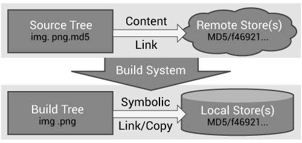

# Testing With CMake and CTest
Testing is a key tool for producing and maintaining robust, valid software. This chapter will examine the tools that are part of CMake to support software testing. We will begin with a brief discussion of testing approaches, and then discuss how to add tests to your software project using CMake.

The tests for a software package may take a number of forms. At the most basic level there are smoke tests, such as one that simply verifies that the software compiles. While this may seem like a simple test, with the wide variety of platforms and configurations available, smoke tests catch more problems than any other type of test. Another form of smoke test is to verify that a test runs without crashing. This can be handy for situations where the developer does not want to spend the time creating more complex tests, but is willing to run some simple tests. Most of the time these simple tests can be small example programs. Running them verifies not only that the build was successful, but that any required shared libraries can be loaded (for projects that use them), and that at least some of the code can be executed without crashing.

Moving beyond basic smoke tests leads to more specific tests such as regression, black-, and white-box testing. Each of these has its strengths. Regression testing verifies that the results of a test do not change over time or platform. This is very useful when performed frequently, as it provides a quick check that the behavior and results of the software have not changed. When a regression test fails, a quick look at recent code changes can usually identify the culprit. Unfortunately, regression tests typically require more effort to create than other tests.

White- and black-box testing refer to tests written to exercise units of code (at various levels of integration), with and without knowledge of how those units are implemented respectively. White-box testing is designed to stress potential failure points in the code knowing how that code was written, and hence its weaknesses. As with regression testing, this can take a substantial amount of effort to create good tests. Black-box testing typically knows little or nothing about the implementation of the software other than its public API. Black-box testing can provide a lot of code coverage without too much effort in developing the tests. This is especially true for libraries of object oriented software where the APIs are well defined. A black-box test can be written to go through and invoke a number of typical methods on all the classes in the software.

The final type of testing we will discuss is software standard compliance testing. While the other test types we have discussed are focused on determining if the code works properly, compliance testing tries to determine if the code adheres to the coding standards of the software project. This could be a check to verify that all classes have implemented some key method, or that all functions have a common prefix. The options for this type of test are limitless and there are a number of ways to perform such testing. There are software analysis tools that can be used, or specialized test programs (maybe python scripts etc) could be written. The key point to realize is that the tests do not necessarily have to involve running some part of the software. The tests might run some other tool on the source code itself.

There are a number of reasons why it helps to have testing support integrated into the build process. First, complex software projects may have a number of configuration or platform-dependent options. The build system knows what options can be enabled and can then enable the appropriate tests for those options. For example, the Visualization Toolkit (VTK) includes support for a parallel processing library called MPI. If VTK is built with MPI support then additional tests are enabled that make use of MPI and verify that the MPI-specific code in VTK works as expected. Secondly, the build system knows where the executables will be placed, and it has tools for finding other required executables (such as perl, python etc). The third reason is that with UNIX Makefiles it is common to have a test target in the Makefile so that developers can type make test and have the test(s) run. In order for this to work, the build system must have some knowledge of the testing process.

## How Does CMake Facilitate Testing?
CMake facilitates testing your software through special testing commands and the [`CTest`](https://cmake.org/cmake/help/latest/manual/ctest.1.html#manual:ctest(1)) executable. First, we will discuss the key testing commands in CMake. To add testing to a CMake-based project, simply [`include(CTest)`](https://cmake.org/cmake/help/latest/command/include.html#command:include) and use the [`add_test`](https://cmake.org/cmake/help/latest/command/add_test.html#command:add_test) command. The [`add_test`](https://cmake.org/cmake/help/latest/command/add_test.html#command:add_test) command has a simple syntax as follows:
```cmake
add_test(NAME TestName COMMAND ExecutableToRun arg1 arg2 ...)
```

The first argument is simply a string name for the test. This is the name that will be displayed by testing programs. The second argument is the executable to run. The executable can be built as part of the project or it can be a standalone executable such as python, perl, etc. The remaining arguments will be passed to the running executable. A typical example of testing using the [`add_test`](https://cmake.org/cmake/help/latest/command/add_test.html#command:add_test) command would look like this:
```cmake
add_executable(TestInstantiator TestInstantiator.cxx)
target_link_libraries(TestInstantiator vtkCommon)
add_test(NAME TestInstantiator
         COMMAND TestInstantiator)
```

The [`add_test`](https://cmake.org/cmake/help/latest/command/add_test.html#command:add_test) command is typically placed in the CMakeLists file for the directory that has the test in it. For large projects, there may be multiple CMakeLists files with [`add_test`](https://cmake.org/cmake/help/latest/command/add_test.html#command:add_test) commands in them. Once the [`add_test`](https://cmake.org/cmake/help/latest/command/add_test.html#command:add_test) commands are present in the project, the user can run the tests by invoking the “test” target of Makefile, or the `RUN_TESTS` target of Visual Studio or Xcode. An example of running tests on the CMake tests using the Makefile generator on Linux would be:
```
$ make test
Running tests...
Test project
     Start 2: kwsys.testEncode
 1/20 Test  #2: kwsys.testEncode ..........   Passed    0.02 sec
     Start 3: kwsys.testTerminal
 2/20 Test  #3: kwsys.testTerminal ........   Passed    0.02 sec
     Start 4: kwsys.testAutoPtr
 3/20 Test  #4: kwsys.testAutoPtr .........   Passed    0.02 sec
```

## Additional Test Properties
By default a test passes if all of the following conditions are true:
- The test executable was found
- The test ran without exception
- The test exited with return code 0

That said, these behaviors can be modified using the [`set_property`](https://cmake.org/cmake/help/latest/command/set_property.html#command:set_property) command:
```cmake
set_property(TEST test_name
             PROPERTY prop1 value1 value2 ...)
```

This command will set additional properties for the specified tests. Example properties are:
- [`ENVIRONMENT`](https://cmake.org/cmake/help/latest/prop_test/ENVIRONMENT.html#prop_test:ENVIRONMENT)

    Specifies environment variables that should be defined for running a test. If set to a list of environment variables and values of the form `MYVAR=value`, those environment variables will be defined while the test is running. The environment is restored to its previous state after the test is done.

- [`LABELS`](https://cmake.org/cmake/help/latest/prop_test/LABELS.html#prop_test:LABELS)

    Specifies a list of text labels associated with a test. These labels can be used to group tests together based on what they test. For example, you could add a label of MPI to all tests that exercise MPI code.

- [`WILL_FAIL`](https://cmake.org/cmake/help/latest/prop_test/WILL_FAIL.html#prop_test:WILL_FAIL)

    If this option is set to true, then the test will pass if the return code is not 0, and fail if it is. This reverses the third condition of the pass requirements.

- [`PASS_REGULAR_EXPRESSION`](https://cmake.org/cmake/help/latest/prop_test/PASS_REGULAR_EXPRESSION.html#prop_test:PASS_REGULAR_EXPRESSION)

    If this option is specified, then the output of the test is checked against the regular expression provided (a list of regular expressions may be passed in as well). If none of the regular expressions match, then the test will fail. If at least one of them matches, then the test will pass.

- [`FAIL_REGULAR_EXPRESSION`](https://cmake.org/cmake/help/latest/prop_test/FAIL_REGULAR_EXPRESSION.html#prop_test:FAIL_REGULAR_EXPRESSION)

    If this option is specified, then the output of the test is checked against the regular expression provided (a list of regular expressions may be passed in as well). If none of the regular expressions match, then the test will pass. If at least one of them matches, then the test will fail.

If both [`PASS_REGULAR_EXPRESSION`](https://cmake.org/cmake/help/latest/prop_test/PASS_REGULAR_EXPRESSION.html#prop_test:PASS_REGULAR_EXPRESSION) and [`FAIL_REGULAR_EXPRESSION`](https://cmake.org/cmake/help/latest/prop_test/FAIL_REGULAR_EXPRESSION.html#prop_test:FAIL_REGULAR_EXPRESSION) are specified, then the [`FAIL_REGULAR_EXPRESSION`](https://cmake.org/cmake/help/latest/prop_test/FAIL_REGULAR_EXPRESSION.html#prop_test:FAIL_REGULAR_EXPRESSION) takes precedence. The following example illustrates using the [`PASS_REGULAR_EXPRESSION`](https://cmake.org/cmake/help/latest/prop_test/PASS_REGULAR_EXPRESSION.html#prop_test:PASS_REGULAR_EXPRESSION) and [`FAIL_REGULAR_EXPRESSION`](https://cmake.org/cmake/help/latest/prop_test/FAIL_REGULAR_EXPRESSION.html#prop_test:FAIL_REGULAR_EXPRESSION):
```cmake
add_test (NAME outputTest COMMAND outputTest)

set (passRegex "^Test passed" "^All ok")
set (failRegex "Error" "Fail")

set_property (TEST outputTest
              PROPERTY PASS_REGULAR_EXPRESSION "${passRegex}")
set_property (TEST outputTest
              PROPERTY FAIL_REGULAR_EXPRESSION "${failRegex}")
```

## Testing Using CTest
When you run the tests from your build environment, what really happens is that the build environment runs [`CTest`](https://cmake.org/cmake/help/latest/manual/ctest.1.html#manual:ctest(1)). [`CTest`](https://cmake.org/cmake/help/latest/manual/ctest.1.html#manual:ctest(1)) is an executable that comes with CMake; it handles running the tests for the project. While CTest works well with CMake, you do not have to use CMake in order to use CTest. The main input file for CTest is called `CTestTestfile.cmake`. This file will be created in each directory that was processed by CMake (typically every directory with a CMakeLists file). The syntax of `CTestTestfile.cmake` is like the regular CMake syntax, with a subset of the commands available. If CMake is used to generate testing files, they will list any subdirectories that need to be processed as well as any [`add_test`](https://cmake.org/cmake/help/latest/command/add_test.html#command:add_test) calls. The subdirectories are those that were added by the [`add_subdirectory`](https://cmake.org/cmake/help/latest/command/add_subdirectory.html#command:add_subdirectory) commands. CTest can then parse these files to determine what tests to run. An example of such a file is shown below:
```cmake
# CMake generated Testfile for
# Source directory: C:/CMake
# Build directory: C:/CMakeBin
#
# This file includes the relevant testing commands required
# for testing this directory and lists subdirectories to
# be tested as well.

add_test (SystemInformationNew ...)

add_subdirectory (Source/kwsys)
add_subdirectory (Utilities/cmzlib)
...
```

When CTest parses the `CTestTestfile.cmake` files, it will extract the list of tests from them. These tests will be run, and for each test CTest will display the name of the test and its status. Consider the following sample output:
```
$ ctest
Test project C:/CMake-build26
        Start 1: SystemInformationNew
 1/21 Test  #1: SystemInformationNew ......   Passed    5.78 sec
        Start 2: kwsys.testEncode
 2/21 Test  #2: kwsys.testEncode ..........   Passed    0.02 sec
        Start 3: kwsys.testTerminal
 3/21 Test  #3: kwsys.testTerminal ........   Passed    0.00 sec
        Start 4: kwsys.testAutoPtr
 4/21 Test  #4: kwsys.testAutoPtr .........   Passed    0.02 sec
        Start 5: kwsys.testHashSTL
 5/21 Test  #5: kwsys.testHashSTL .........   Passed    0.02 sec
...
100% tests passed, 0 tests failed out of 21
Total Test time (real) =  59.22 sec
```

CTest is run from within your build tree. It will run all the tests found in the current directory as well as any subdirectories listed in the `CTestTestfile.cmake`. For each test that is run CTest will report if the test passed and how long it took to run the test.

The CTest executable includes some handy command line options to make testing a little easier. We will start by looking at the options you would typically use from the command line.
```shell
-R <regex>            Run tests matching regular expression
-E <regex>            Exclude tests matching regular expression
-L <regex>            Run tests with labels matching the regex
-LE <regex>           Run tests with labels not matching regexp
-C <config>           Choose the configuration to test
-V,--verbose          Enable verbose output from tests.
-N,--show-only        Disable actual execution of tests.
-I [Start,End,Stride,test#,test#|Test file]
                      Run specific tests by range and number.
-H                                        Display a help message
```

The `-R` option is probably the most commonly used. It allows you to specify a regular expression; only the tests with names matching the regular expression will be run. Using the `-R` option with the name (or part of the name) of a test is a quick way to run a single test. The `-E` option is similar except that it excludes all tests matching the regular expression. The `-L` and `-LE` options are similar to `-R` and `-E`, except that they apply to test labels that were set using the [`set_property`](https://cmake.org/cmake/help/latest/command/set_property.html#command:set_property) command described previously. The `-C` option is mainly for IDE builds where you might have multiple configurations, such as Release and Debug in the same tree. The argument following the `-C` determines which configuration will be tested. The `-V` argument is useful when you are trying to determine why a test is failing. With `-V`, CTest will print out the command line used to run the test, as well as any output from the test itself. The `-V` option can be used with any invocation of CTest to provide more verbose output. The `-N` option is useful if you want to see what tests CTest would run without actually running them.

Running the tests and making sure they all pass before committing any changes to the software is a sure-fire way to improve your software quality and development process. Unfortunately, for large projects the number of tests and the time required to run them may be prohibitive. In these situations the `-I` option of CTest can be used. The `-I` option allows you to flexibly specify a subset of the tests to run. For example, the following invocation of CTest will run every seventh test.
```shell
ctest -I ,,7
```

While this is not as good as running every test, it is better than not running any and it may be a more practical solution for many developers. Note that if the start and end arguments are not specified, as in this example, then they will default to the first and last tests. In another example, assume that you always want to run a few tests plus a subset of the others. In this case you can explicitly add those tests to the end of the arguments for `-I`. For example:
```shell
ctest -I ,,5,1,2,3,10
```

will run tests 1, 2, 3, and 10, plus every fifth test. You can pass as many test numbers as you want after the stride argument.

## Using CTest to Drive Complex Tests
Sometimes to properly test a project you need to actually compile code during the testing phase. There are several reasons for this. First, if test programs are compiled as part of the main project, they can end up taking up a significant amount of the build time. Also, if a test fails to build, the main build should not fail as well. Finally, IDE projects can quickly become too large to load and work with. The CTest command supports a group of command line options that allow it to be used as the test executable to run. When used as the test executable, CTest can run CMake, run the compile step, and finally run a compiled test. We will now look at the command line options to CTest that support building and running tests.
```shell
--build-and-test  src_directory build_directory
Run cmake on the given source directory using the specified build directory.
--test-command        Name of the program to run.
--build-target        Specify a specific target to build.
--build-nocmake       Run the build without running cmake first.
--build-run-dir       Specify directory to run programs from.
--build-two-config    Run cmake twice before the build.
--build-exe-dir       Specify the directory for the executable.
--build-generator     Specify the generator to use.
--build-project       Specify the name of the project to build.
--build-makeprogram   Specify the make program to use.
--build-noclean       Skip the make clean step.
--build-options       Add extra options to the build step.
```

For an example, consider the following [`add_test`](https://cmake.org/cmake/help/latest/command/add_test.html#command:add_test) command taken from the CMakeLists.txt file of CMake itself. It shows how CTest can be used both to compile and run a test.
```cmake
add_test(simple ${CMAKE_CTEST_COMMAND}
   --build-and-test "${CMAKE_SOURCE_DIR}/Tests/Simple"
                    "${CMAKE_BINARY_DIR}/Tests/Simple"
   --build-generator ${CMAKE_GENERATOR}
   --build-makeprogram ${CMAKE_MAKE_PROGRAM}
   --build-project Simple
   --test-command simple)
```

In this example, the [`add_test`](https://cmake.org/cmake/help/latest/command/add_test.html#command:add_test) command is first passed the name of the test, “simple”. After the name of the test, the command to be run is specified. In this case, the test command to be run is CTest. The CTest command is referenced via the [`CMAKE_CTEST_COMMAND`](https://cmake.org/cmake/help/latest/variable/CMAKE_CTEST_COMMAND.html#variable:CMAKE_CTEST_COMMAND) variable. This variable is always set by CMake to the CTest command that came from the CMake installation used to build the project. Next, the source and binary directories are specified. The next options to CTest are the `--build-generator` and `--build-makeprogram` options. These are specified using the CMake variables [`CMAKE_MAKE_PROGRAM`](https://cmake.org/cmake/help/latest/variable/CMAKE_MAKE_PROGRAM.html#variable:CMAKE_MAKE_PROGRAM) and [`CMAKE_GENERATOR`](https://cmake.org/cmake/help/latest/variable/CMAKE_GENERATOR.html#variable:CMAKE_GENERATOR). Both [`CMAKE_MAKE_PROGRAM`](https://cmake.org/cmake/help/latest/variable/CMAKE_MAKE_PROGRAM.html#variable:CMAKE_MAKE_PROGRAM) and [`CMAKE_GENERATOR`](https://cmake.org/cmake/help/latest/variable/CMAKE_GENERATOR.html#variable:CMAKE_GENERATOR) are defined by CMake. This is an important step as it makes sure that the same generator is used for building the test as was used for building the project itself. The `--build-project` option is passed `Simple`, which corresponds to the project command used in the Simple test. The final argument is the `--test-command` which tells CTest the command to run once it gets a successful build, and should be the name of the executable that will be compiled by the test.

## Handling a Large Number of Tests
When a large number of tests exist in a single project, it is cumbersome to have individual executables available for each test. That said, the developer of the project should not be required to create tests with complex argument parsing. This is why CMake provides a convenience command for creating a test driver program. This command is called [`create_test_sourcelist`](https://cmake.org/cmake/help/latest/command/create_test_sourcelist.html#command:create_test_sourcelist). A test driver is a program that links together many small tests into a single executable. This is useful when building static executables with large libraries to shrink the total required size. The signature for [`create_test_sourcelist`](https://cmake.org/cmake/help/latest/command/create_test_sourcelist.html#command:create_test_sourcelist) is as follows:
```cmake
create_test_sourcelist (SourceListName
                        DriverName
                        test1 test2 test3
                        EXTRA_INCLUDE include.h
                        FUNCTION function
                        )
```

The first argument is the variable which will contain the list of source files that must be compiled to make the test executable. The DriverName is the name of the test driver program (e.g. the name of the resulting executable). The rest of the arguments consist of a list of test source files. Each test source file should have a function in it that has the same name as the file with no extension (`foo.cxx` should have `int foo(argc, argv);`). The resulting executable will be able to invoke each of the tests by name on the command line. The `EXTRA_INCLUDE` and `FUNCTION` arguments support additional customization of the test driver program. Consider the following CMakeLists file fragment to see how this command can be used:
```cmake
# create the testing file and list of tests
set (TestToRun
  ObjectFactory.cxx
  otherArrays.cxx
  otherEmptyCell.cxx
  TestSmartPointer.cxx
  SystemInformation.cxx
  ...
)
create_test_sourcelist (Tests CommonCxxTests.cxx ${TestToRun})

# add the executable
add_executable (CommonCxxTests ${Tests})

# Add all the ADD_TEST for each test
foreach (test ${TestsToRun})
  get_filename_component (TName ${test} NAME_WE)
  add_test (NAME ${TName} COMMAND CommonCxxTests ${TName})
endforeach ()
```

The [`create_test_sourcelist`](https://cmake.org/cmake/help/latest/command/create_test_sourcelist.html#command:create_test_sourcelist) command is invoked to create a test driver. In this case it creates and writes `CommonCxxTests.cxx` into the binary tree of the project, using the rest of the arguments to determine its contents. Next, the [`add_executable`](https://cmake.org/cmake/help/latest/command/add_executable.html#command:add_executable) command is used to add that executable to the build. Then a new variable called `TestsToRun` is created with an initial value of the sources required for the test driver. Then, a [`foreach`](https://cmake.org/cmake/help/latest/command/foreach.html#command:foreach) command is used to loop over the remaining sources. For each source, its name without a file extension is extracted and put in the variable `TName`, then a new test is added for `TName`. The end result is that for each source file in the [`create_test_sourcelist`](https://cmake.org/cmake/help/latest/command/create_test_sourcelist.html#command:create_test_sourcelist) an [`add_test`](https://cmake.org/cmake/help/latest/command/add_test.html#command:add_test) command is called with the name of the test. As more tests are added to the [`create_test_sourcelist`](https://cmake.org/cmake/help/latest/command/create_test_sourcelist.html#command:create_test_sourcelist) command, the [`foreach`](https://cmake.org/cmake/help/latest/command/foreach.html#command:foreach) loop will automatically call [`add_test`](https://cmake.org/cmake/help/latest/command/add_test.html#command:add_test) for each one.

## Managing Test Data
In addition to handling large numbers of tests, CMake contains a system for managing test data. It is encapsulated in an [`ExternalData`](https://cmake.org/cmake/help/latest/module/ExternalData.html#module:ExternalData) CMake module, downloads large data on an as-needed basis, retains version information, and allows distributed storage.

The design of the [`ExternalData`](https://cmake.org/cmake/help/latest/module/ExternalData.html#module:ExternalData) follows that of distributed version control systems using hash-based file identifiers and object stores, but it also takes advantage of the presence of a dependency-based build system. The figure below illustrates the approach. Source trees contain lighweight “content links” referencing data in remote storage by hashes of their content. The [`ExternalData`](https://cmake.org/cmake/help/latest/module/ExternalData.html#module:ExternalData) module produces build rules to download the data to local stores and reference them from build trees by symbolic links (copies on Windows).

<figure id="figure-1">
  
  <figcaption>Figure 1: ExternalData module flow chart</figcaption>
</figure>

A content link is a small, plain text file containing a hash of the real data. Its name is the same as its data file, with an additional extension identifying the hash algorithm e.g. img.png.md5. Content links always take the same (small) amount of space in the source tree regardless of the real data size. The CMakeLists.txt CMake configuration files refer to data using a DATA{} syntax inside calls to the [`ExternalData`](https://cmake.org/cmake/help/latest/module/ExternalData.html#module:ExternalData) module API. For example, DATA{img.png} tells the [`ExternalData`](https://cmake.org/cmake/help/latest/module/ExternalData.html#module:ExternalData) module to make img.png available in the build tree even if only a img.png.md5 content link appears in the source tree.

The [`ExternalData`](https://cmake.org/cmake/help/latest/module/ExternalData.html#module:ExternalData) module implements a flexible system to prevent duplication of content fetching and storage. Objects are retrieved from a list of (possibly redundant) local and remote locations specified in the [`ExternalData`](https://cmake.org/cmake/help/latest/module/ExternalData.html#module:ExternalData) CMake configuration as a list of “URL templates”. The only requirement of remote storage systems is the ability to fetch from a URL that locates content through specification of the hash algorithm and hash value. Local or networked file systems, an Apache FTP server or a [`Midas`](https://www.midasplatform.org/) server , for example, all have this capability. Each URL template has %(algo) and %(hash) placeholders for [`ExternalData`](https://cmake.org/cmake/help/latest/module/ExternalData.html#module:ExternalData) to replace with values from a content link.

A persistent local object store can cache downloaded content to share among build trees by setting the `ExternalData_OBJECT_STORES` CMake build configuration variable. This is helpful to de-duplicate content for multiple build trees. It also resolves an important pragmatic concern in a regression testing context; when many machines simultaneously start a nightly dashboard build, they can use their local object store instead of overloading the data servers and flooding network traffic.

Retrieval is integrated with a dependency-based build system, so resources are fetched only when needed. For example, if the system is used to retrieve testing data and `BUILD_TESTING` is OFF, the data are not retrieved unnecessarily. When the source tree is updated and a content link changes, the build system fetches the new data as needed.

Since all references leaving the source tree go through hashes, they do not depend on any external state. Remote and local object stores can be relocated without invalidating content links in older versions of the source code. Content links within a source tree can be relocated or renamed without modifying the object stores. Duplicate content links can exist in a source tree, but download will only occur once. Multiple versions of data with the same source tree file name in a project’s history are uniquely identified in the object stores.

Hash-based systems allow the use of untrusted connections to remote resources because downloaded content is verified after it is retrieved. Configuration of the URL templates list improves robustness by allowing multiple redundant remote storage resources. Storage resources can also change over time on an as-needed basis. If a project’s remote storage moves over time, a build of older source code versions is always possible by adjusting the URL templates configured for the build tree or by manually populating a local object store.

A simple application of the [`ExternalData`](https://cmake.org/cmake/help/latest/module/ExternalData.html#module:ExternalData) module looks like the following:
```cmake
include(ExternalData)
set(midas "http://midas.kitware.com/MyProject")


# Add standard remote object stores to user's
# configuration.
list(APPEND ExternalData_URL_TEMPLATES
 "${midas}?algorithm=%(algo)&hash=%(hash)"
 "ftp://myproject.org/files/%(algo)/%(hash)"
 )
# Add a test referencing data.
ExternalData_Add_Test(MyProjectData
 NAME SmoothingTest
 COMMAND SmoothingExe DATA{Input/Image.png}
                    SmoothedImage.png
 )
# Add a build target to populate the real data.
ExternalData_Add_Target(MyProjectData)
```

The `ExternalData_Add_Test` function is a wrapper around CMake’s [`add_test`](https://cmake.org/cmake/help/latest/command/add_test.html#command:add_test) command. The source tree is probed for a Input/Image.png.md5 content link containing the data’s MD5 hash. After checking the local object store, a request is made sequentially to each URL in the `ExternalData_URL_TEMPLATES` list with the data’s hash. Once found, a symlink is created in the build tree. The DATA{Input/Image.png} path will expand to the build tree path in the test command line. Data are retrieved when the MyProjectData target is built.
